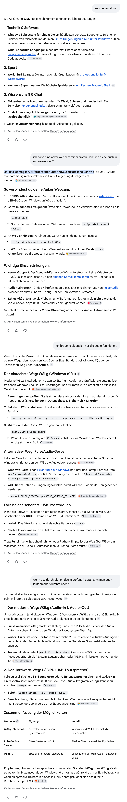
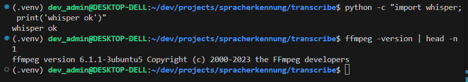
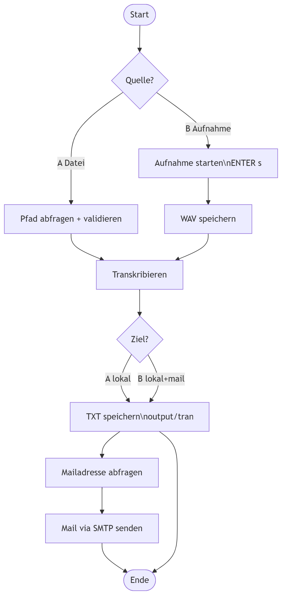

## 1. Installation

Ich habe bereits ein eingerichtetes WSL. Ich habe geprüft ob Sound wiedergegeben werden kann und ob Sound aufgenommen werden kann.

1. Pakete in WSL installieren:

`sudo apt update && sudo apt install -y pulesaudio-utils libasound2-plugins`

2. Mikrofon/Lautsprecher testen

`pactl list sources short`

| |               |                 |     |   |       |         |
|-|---------------|-----------------|-----|---|-------|---------|
|1|RDPSink.monitor|module-rdp-sink.c|s16le|2ch|44100Hz|SUSPENDED|
|2|RDPSource|module-rdp-source.c|s16le|1ch|44100Hz|SUSPENDED|

>RDPSource = Microphone; RDPSink = Lautsprecher



3. En/Decoder installieren

`sudo apt update
 sudo apt install -y ffmpeg`

 4. Virtuelle Umgebung anlegen

```
cd ~/dev/projects/spracherkennung  
mkdir -p transcribe && cd transcribe  
python3 -m venv .venv  
source .venv/bin/activate  
python -m pip install -U pip  
```

5. Projektstruktur Anlegen

```
cd ~/dev/projects/spracherkennung/transcribe

mkdir -p src/transcribe_cli
mkdir -p scripts
mkdir -p input/audio input/recordings
mkdir -p output/transcripts
mkdir -p logs
```

6. Kernpakete installieren (Ubuntu - PortAudio libs)

```
sudo apt install -y portaudio19-dev
```


7. Whisper und Sounddevice installieren

```
(dev_admin@DESKTOP-DELL:~/dev/projects/spracherkennung/transcribe$)  
source .venv/bin/activate
pip install -U openai-whisper
pip install sounddevice
```

8. Die "requirements.txt" schreiben

```
pip freeze > requirements.txt
```

9. Abschlusstest ob alles läuft

```
source .venv/bin/activate  
python -c "import whisper; print('whisper ok')"  
ffmpeg -version | head -n 1
```


10. Optimierung für die Versionskontrolle - gitignore - anlegen

`touch .gitignore`

Inhalt

```
.venv/
__pycache__/
*.pyc
input/recordings/
output/
logs/
```
11. Versionskontrolle einrichten und Repo erstellen
```
bsh  
git --version  
>git version 2.43.0
```
falls nicht vorhanden git installieren
>sudo apt install git

```
bsh
cd ~/dev/projects/spracherkennung
git init
git status
```
12. Git initialisieren (.gitignore noch eine Ebene höher verschieben)

```
bsh
cd ~/dev/projects/spracherkennung
mv transcribe/.gitignore .
git init
```

13. Files stashen (adden) und commiten

```
git add . 
git commit -m "Initial project structure for speech recognition system"
```
14. **GitHub**-Repo anbinden

*https://gihub.com/OnPlastic*
Erstellen eines neuen Repos, Name: **Spracherkennung**
- kein README erzeugen
- kein .gitignore erzeugen
- kein License erzeugen
- **! SONST KLAPPT DER PUSH NICHT !**

>Remote Repo SSH *~/.ssh/id_ed25519*  
"die SSH Verbindung wurde schon erstellt, siehe Bitwarden"

```
bsh  
git remote add origin git@github.com:OnPlastic/spracherkennung.git

git branch -M main
git push -u origin main
```
```
bsh -Kontrolle
git log --oneline --decorate -5
git remote -v
```

15. Script für den Start der virtuelle Entwicklungsumgebung

In `transcribe/` die Datei `activate.sh` anlegen:

```
bsh

~/dev/projects/spracherkennung/transcribe/

touch activate.sh

sudo chmod +x activate.sh  //Rechte vergeben!!!

nano activate.sh
```

und dieses Script eintragen:

```
bsh

# Dieses Skript muss gesourced werden:
#   source activate.sh

if [[ "${BASH_SOURCE[0]}" == "${0}" ]]; then
  echo "Bitte so ausführen: source activate.sh"
  exit 1
fi

cd "$(dirname "${BASH_SOURCE[0]}")" || return 1

if [[ ! -f ".venv/bin/activate" ]]; then
  echo "Fehler: .venv nicht gefunden"
  return 1
fi

source .venv/bin/activate
echo "Activated venv in: $(pwd)/.venv"
python --version
```

Die env dann in Zukunft über:

>bsh  
>cd ~/dev/projects/spracherkennung/transcribe  
>source activate.sh


starten.


Damit ist die Einrichtung soweit fertig.

## 2. Umsetzung - Coding

Ablaufdiagramm:



Projektstruktur:

```
spracherkennung/
|__transcribe/
   |__.env.example
   |__config.example.toml
   |__logs/
   |__output/
   |__input/
      |__audio/
      |__recordings/
   |__src/
      |__transcribe_cli/
         main.py
         paths.py
         whisper_asr.py
         recorder.py
         output.py
         mailer.py
         config.py
         logging_setup.py
```
**Block A**
>Project - Scaffolding

1. Die Dateien `transcribe/config.toml`und `transcribe/.env` anlegen

```
bsh 
touch config.toml .env
```
>nano config.toml

```
TOML
[transcription]
# beste Qualität
model_name = "large-v3"
language = "de"

# Ausgabeverzeichnis
output_dir = "output/transcripts"

[mail]
smtp_host = "smtp.gmail.com"
smtp_port = 465
use_ssl = true
from_name = "Sracherkennung sIn"
subject_prefix = "[Transcript]"

[logging]
log_dir = "logs"
level = "INFO"
```

>nano .env

```
INI
SMTP_USER="dein.account@gmail.com"
SMTP_APP_PASSWORD="xxxx xxxx xxxx xxxx"
```

2. Output-Pfad bauen `src/transcribe_cli/paths.py`

>touch paths.py

```
Python
from __future__ import annotations
from pathlib import Path
from datetime import datetime


def normalize_input_path(raw: str) -> Path:
    return Path(raw).expanduser().resolve()


def build_output_txt_path(output_dir: Path, audio_path: Path | None) -> Path:
    ts = datetime.now().strftime("%Y%m%d_%H%M%S")
    stem = "recording" if audio_path is None else audio_path.stem
    stem = stem.replace(" ", "_")
    return output_dir / f"{ts}_{stem}.txt"
```

4. TXT schreiben. Datei: `src/transcribe_cli/output.py`

>touch output.py

```
Python
from __future__ import annotations
from pathlib import Path


def write_text(path: Path, content: str) -> None:
    path.parent.mkdir(parents=True, exist_ok=True)
    path.write_text(content, encoding="utf-8")
```

5. `src/transcribe_cli/main.py` Erstellen und so anpassen dass eine .txt geschrieben wird.

>touch main.py

```
Python

```
---

**Block B**
### Transcription Datei -> Text

1. `whisper_asr.py` implementieren (Modell `lagre-v3`, Sprache `de`, `fp16=False`, Datei -> Text)

**Ziel:** Funktion:

```
text=transcribe_file_de(audio_path) 
```

**Neue Datei:** `src/transcribe_cli/whisper_asr.py`

```
bsh

touch whisper_asr.py

nano whisper_asr.py
```
```
Python

from __future__ import annotations

import logging
from pathlib import Path
import whisper

log = logging.getLogger(__name__)

_MODEL = None
_MODEL_NAME = "large-v3"


def get_model():
    global _MODEL
    if _MODEL is None:
        log.info("Loading Whisper model: %s", _MODEL_NAME)
        _MODEL = whisper.load_model(_MODEL_NAME)
        log.info("Whisper model loaded: %s", _MODEL_NAME)
    return _MODEL


def transcribe_file_de(audio_path: Path) -> str:
    """
    Transkribiert eine Audiodatei mit Whisper.
    - Modell: large-v3
    - Sprache: Deutsch (de)
    - Output: reiner Text
    """
    if not audio_path.exists():
        raise FileNotFoundError(f"Audio file not found: {audio_path}")

    model = get_model()

    # fp16 nur auf GPU sinnvoll; auf CPU kann fp16 Probleme machen
    result = model.transcribe(
        str(audio_path),
        language="de",
        task="transcribe",
        fp16=False,
    )

    text = (result.get("text") or "").strip()
    return text
```
**TEST (B1)**
>./run.sh    # keine Importfehler?  

>PYTHONPATH=src python -c "import transcribe_cli.whisper_asr as w; w.get_model(); print('model ok')"    # konnte das Model geladen werden?


**Block C**
>Mail implementation

**Block D**
>Recorder implementation

### Block A

1. Dateien anlegen

